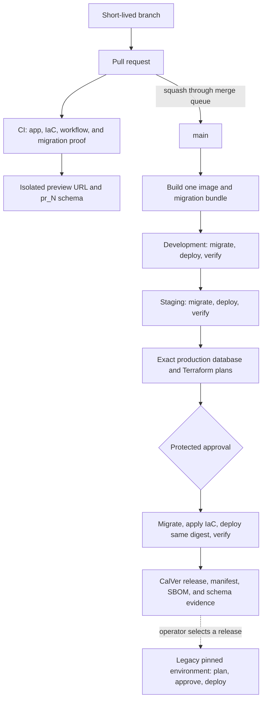

# Palladium delivery reference

A complete, opinionated example of trunk-based delivery for an Angular frontend, Flask API,
PostgreSQL/Flyway schema, and Terraform infrastructure—all orchestrated by GitHub Actions.

The contract is deliberately simple: one permanent branch, one container digest, one migration
bundle, and one visible promotion path. Pull requests prove changes in isolation; merges flow
automatically through development and staging; production requires approval of the exact database
and infrastructure plans that automation will apply.

## Delivery in one minute



| Stage | Trigger | What happens | Human gate | Durable evidence |
|---|---|---|---|---|
| Pull request | Branch update | Test app and IaC, rehearse migrations, publish preview | Code review | Checks, exact SQL, schema diff, Terraform diffs, preview URL |
| Development | Squash merge to `main` | Migrate first, then deploy and smoke-test the new digest | None | Target schema receipt and deployment artifact |
| Staging | Development succeeds | Migrate first, deploy the same digest, then run browser acceptance | None | Target schema receipt and Playwright results |
| Production | Staging succeeds | Generate exact schema and Terraform plans; apply those plans and the same digest | Protected environment approval | CalVer release, manifest, SBOM, plans, checksums, and receipts |
| Legacy pinned environment | Operator selects a published release | Verify the release and migration bundle, then create target-specific plans | Protected approval plus change record | Workflow URL, reviewed plans, release manifest, and deployment receipt |

A legacy pinned environment is intentionally outside continuous promotion. It stays on its selected,
already-published release until an operator repeats the audited pinning workflow. It never builds a
new artifact and cannot silently follow `main`. See the
[legacy pinning runbook](docs/runbooks/legacy-pinned-environment.md).

Fork pull requests receive the complete unprivileged source and migration rehearsal checks, but no
cloud preview or state-backed plan because fork code never receives deployment credentials.

The rules that make this predictable are equally short:

- `main` is the only permanent branch; every change, including a hotfix, uses a short-lived PR and
  squash merge through the queue.
- Every environment pulls the same digest from one immutable ECR repository. Tags help people find
  artifacts; deployments use digest identity.
- Every PR receives an isolated URL and database schema. Closing the PR destroys both, with a
  seven-day TTL reaper as backup.
- Every PR shows the three long-lived Terraform diffs and rehearses its Flyway SQL against disposable
  PostgreSQL built from the merge base.
- Roll-forward is normal recovery. The exceptional rollback workflow changes only the application
  alias; it never reverses a database migration or reapplies Terraform.
- Weekday refresh-only plans detect infrastructure drift.

## Local development

The only hard dependency is Docker:

```bash
cp .env.example .env
make dev
```

Open <http://localhost:4200>. Angular and Flask both live-reload; Angular proxies `/api` and
`/healthz` to Flask, matching the production same-origin contract. Dependencies live in named
volumes, so the working tree stays clean.

For a faster native loop, install [mise](https://mise.jdx.dev/) and run:

```bash
mise install
make setup
make dev-native
```

Useful commands are intentionally few:

| Command | Purpose |
|---|---|
| `make dev` | Start the full hot-reload stack in Docker |
| `make check` | Run the same format, lint, type, test, build, and Terraform checks as CI |
| `make test` | Run both unit-test suites |
| `make build` | Build the production Lambda-compatible container locally |
| `make db-plan` | Write `.cache/schema-plan.{json,md}` and print exact pending SQL and hashes |
| `make db-reset` | Rebuild the disposable local database from every migration |
| `make clean` | Stop the stack and remove its named dependency volumes |

The complete evidence ladder and the question each check answers are documented in
[CI proof](docs/ci-proof.md).

## Repository map

```text
app/
  backend/                 Flask factory, API, and pytest suite
  frontend/                Standalone Angular application and Vitest suite
database/migrations/       Immutable forward-only Flyway SQL
terraform/
  bootstrap/               Shared state, one ECR repository, and GitHub OIDC trust
  live/                    Thin environment root and non-secret sizing policy
  modules/web-service/     Reusable Lambda + URL + logs + alarms module
.github/workflows/
  ci.yml                   Parallel proof and build-once artifact
  preview*.yml             Trusted preview deployment, cleanup, and TTL reaper
  delivery.yml             Development -> staging -> approved production
  legacy-promote.yml       Audited release pin for a legacy environment
  rollback.yml             Exceptional app-only alias restore
  drift.yml                Scheduled refresh-only plans
  platform-bootstrap.yml   One-time account trust bootstrap
scripts/                   Identical local and CI entrypoints
```

The production container contains the compiled Angular assets and serves them through Flask. That
keeps configuration runtime-based, eliminates CORS, and makes every environment—including a PR
preview—one cheap, scale-to-zero unit. Lambda Web Adapter preserves a normal WSGI development
model. For sustained high-throughput or long-running requests, keep the delivery contract and swap
only the Terraform service module for ECS or another container runtime.

## Environment controls

The example intentionally uses one AWS deployment account and exactly one ECR repository. Isolation
comes from separate Terraform state keys, named resources, serialized jobs, and protected GitHub
Environments. Centralizing the registry makes “build once, promote by digest” literal: no copy can
silently produce a different environment artifact.

| GitHub Environment | Deployment moment | Protection |
|---|---|---|
| `preview` | Successful same-repository PR CI | No approval; deploy role |
| `plan` | PR and pre-production speculative plans | No approval; read-only role |
| `development` | Every successful `main` CI run | No approval |
| `staging` | Development smoke test succeeds | No approval |
| `production` | Exact plan exists after staging | Required reviewers; no self-review |
| `legacy` | Operator selects a published release | Required reviewers + change record |

Each environment defines non-secret variables `AWS_ROLE_ARN`, `AWS_REGION`, `ECR_REPOSITORY`, and
`TF_STATE_BUCKET`. See [repository setup](docs/repository-setup.md) for the exact controls.

Published releases include a schema-validated [release manifest](docs/release-manifest.md), the exact
database migration bundle, and a CycloneDX SBOM. The Flyway review/apply contract is documented in
[schema delivery](docs/schema-delivery.md) and [ADR 0006](docs/adr/0006-forward-only-database-migrations.md).
Artifact names and ECR lifecycle behavior are fixed by
[ADR 0004](docs/adr/0004-artifact-naming-and-retention.md); hotfix, recovery, and legacy pinning are
fixed by [ADR 0005](docs/adr/0005-hotfix-recovery-and-legacy-pinning.md).

## Versioning decision

This deployable service uses calendar versioning: `YYYY.MM.DD.<CI run number>`, for example
`2026.09.02.143`. It answers the operational question people ask most often—“when did this ship?”—
and the final monotonically unique component prevents collisions when several changes ship a day.
The full Git SHA, OCI digest, GitHub run ID, and run attempt remain the technical identity; CalVer is
the human release identity. A rerun has its own candidate and artifact names, so evidence never
silently collides.

Semantic versioning is intentionally not used for this application. SemVer communicates compatibility
of a consumed public contract, not deployment order. If this repository later publishes an SDK or
versioned public API, version that artifact independently with SemVer while keeping service releases
on CalVer. Full reasoning is in [ADR 0002](docs/adr/0002-calendar-versioning.md).

## First-time setup

Deployment setup requires repository-administrator access, an AWS account with bootstrap permission,
and PostgreSQL endpoints reachable from the selected GitHub runners. Local development requires only
Docker; the optional native loop uses `mise`.

1. Create a temporary `bootstrap` GitHub Environment. Add short-lived `AWS_ACCESS_KEY_ID`,
   `AWS_SECRET_ACCESS_KEY`, and, when applicable, `AWS_SESSION_TOKEN` secrets.
2. Run **Platform bootstrap** once. It creates the versioned Terraform state bucket, the single
   immutable ECR repository, environment-scoped deployment roles, and a read-only plan OIDC role.
3. Create `preview`, `plan`, `development`, `staging`, `production`, and `legacy`; copy the values shown
   in the summary. `plan` receives the plan role ARN, while every deploy environment receives the
   deploy role ARN. Delete the bootstrap credentials immediately.
4. Configure the rules in [repository setup](docs/repository-setup.md), especially required checks,
   automatic branch deletion, the squash-only merge queue, and protected reviewers.
5. Configure environment-scoped PostgreSQL migration credentials and verify runner connectivity as
   described in [repository setup](docs/repository-setup.md).
6. Set `DATABASE_DEPLOYMENTS_ENABLED=true`. This enables persistent and preview schema delivery.
7. Set `DEPLOYMENTS_ENABLED=true` as the final commissioning switch. Until then, successful CI runs
   prove the repository without attempting cloud deployments.
8. Open a small pull request. Its preview is the acceptance test for the platform itself.

After bootstrap, no developer or workflow needs a long-lived AWS key and no deployment is performed
outside GitHub Actions.
