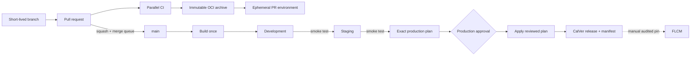

# Palladium delivery reference

An opinionated, production-shaped example of a calm trunk-based delivery system. It combines an
Angular frontend, a Flask API, Terraform, and GitHub Actions without hiding the hard parts:
promotion, ephemeral environments, audit pinning, drift, recovery, and first-time trust.

## The experience



- `main` is the only permanent branch. There are no environment or release branches.
- Pull requests receive a real, isolated URL after all checks pass. A trusted follow-up workflow
  performs the deployment, so pull-request code never receives AWS credentials.
- A merge builds one container. Every environment pulls the same digest from one immutable ECR
  repository; the artifact is never rebuilt, copied, or retagged per environment.
- Development and staging are continuous. Production uses a GitHub Environment approval gate.
- Closing a PR destroys its preview. A seven-day TTL reaper is a second safety net.
- Every PR shows read-only development, staging, and production Terraform diffs. Production applies
  the exact reviewed binary plan, not a freshly generated approximation.
- Weekday refresh-only plans detect drift. Recovery is roll-forward by default; the exceptional
  rollback workflow changes only the application alias and never changes infrastructure.

## Local development

The only hard dependency is Docker:

```bash
cp .env.example .env
make dev
```

Open <http://localhost:4200>. Angular and Flask both live-reload; Angular proxies `/api` and
`/healthz` to Flask, matching the production same-origin contract. Dependencies live in named
volumes, so the working tree stays clean.

For a faster native loop, install [mise](https://mise.jdx.dev/) and run:

```bash
mise install
make setup
make dev-native
```

Useful commands are intentionally few:

| Command | Purpose |
|---|---|
| `make dev` | Start the full hot-reload stack in Docker |
| `make check` | Run the same format, lint, type, test, build, and Terraform checks as CI |
| `make test` | Run both unit-test suites |
| `make build` | Build the production Lambda-compatible container locally |
| `make clean` | Stop the stack and remove its named dependency volumes |

The complete evidence ladder and the question each check answers are documented in
[CI proof](docs/ci-proof.md).

## Repository map

```text
app/
  backend/                 Flask factory, API, and pytest suite
  frontend/                Standalone Angular application and Vitest suite
terraform/
  bootstrap/               Shared state, one ECR repository, and GitHub OIDC trust
  live/                    Thin environment root and non-secret sizing policy
  modules/web-service/     Reusable Lambda + URL + logs + alarms module
.github/workflows/
  ci.yml                   Parallel proof and build-once artifact
  preview*.yml             Trusted preview deployment, cleanup, and TTL reaper
  delivery.yml             Development -> staging -> approved production
  flcm-promote.yml         Audited manual release pin for FLCM
  rollback.yml             Exceptional app-only alias restore
  drift.yml                Scheduled refresh-only plans
  platform-bootstrap.yml   One-time account trust bootstrap
scripts/                   Identical local and CI entrypoints
```

The production container contains the compiled Angular assets and serves them through Flask. That
keeps configuration runtime-based, eliminates CORS, and makes every environment—including a PR
preview—one cheap, scale-to-zero unit. Lambda Web Adapter preserves a normal WSGI development
model. For sustained high-throughput or long-running requests, keep the delivery contract and swap
only the Terraform service module for ECS or another container runtime.

## Environment policy

The example intentionally uses one AWS deployment account and exactly one ECR repository. Isolation
comes from separate Terraform state keys, named resources, serialized jobs, and protected GitHub
Environments. Centralizing the registry makes “build once, promote by digest” literal: no copy can
silently produce a different environment artifact.

| GitHub Environment | Deployment moment | Protection |
|---|---|---|
| `preview` | Successful same-repository PR CI | No approval; deploy role |
| `plan` | PR and pre-production speculative plans | No approval; read-only role |
| `development` | Every successful `main` CI run | No approval |
| `staging` | Development smoke test succeeds | No approval |
| `production` | Exact plan exists after staging | Required reviewers; no self-review |
| `flcm` | Operator selects a published release | Required reviewers + change record |

Each environment defines non-secret variables `AWS_ROLE_ARN`, `AWS_REGION`, `ECR_REPOSITORY`, and
`TF_STATE_BUCKET`. See [repository setup](docs/repository-setup.md) for the exact controls.

Published releases include a schema-validated [release manifest](docs/release-manifest.md) and
CycloneDX SBOM. Artifact names and ECR lifecycle behavior are fixed by
[ADR 0004](docs/adr/0004-artifact-naming-and-retention.md); hotfix, recovery, and FLCM behavior are
fixed by [ADR 0005](docs/adr/0005-hotfix-recovery-and-flcm.md).

## Versioning decision

This deployable service uses calendar versioning: `YYYY.MM.DD.<CI run number>`, for example
`2026.09.02.143`. It answers the operational question people ask most often—“when did this ship?”—
and the final monotonically unique component prevents collisions when several changes ship a day.
The full Git SHA, OCI digest, GitHub run ID, and run attempt remain the technical identity; CalVer is
the human release identity. A rerun has its own candidate and artifact names, so evidence never
silently collides.

Semantic versioning is intentionally not used for this application. SemVer communicates compatibility
of a consumed public contract, not deployment order. If this repository later publishes an SDK or
versioned public API, version that artifact independently with SemVer while keeping service releases
on CalVer. Full reasoning is in [ADR 0002](docs/adr/0002-calendar-versioning.md).

## First-time setup

1. Create a temporary `bootstrap` GitHub Environment. Add short-lived `AWS_ACCESS_KEY_ID`,
   `AWS_SECRET_ACCESS_KEY`, and, when applicable, `AWS_SESSION_TOKEN` secrets.
2. Run **Platform bootstrap** once. It creates the versioned Terraform state bucket, the single
   immutable ECR repository, environment-scoped deployment roles, and a read-only plan OIDC role.
3. Create `preview`, `plan`, `development`, `staging`, `production`, and `flcm`; copy the values shown
   in the summary. `plan` receives the plan role ARN, while every deploy environment receives the
   deploy role ARN. Delete the bootstrap credentials immediately.
4. Configure the rules in [repository setup](docs/repository-setup.md), especially the merge queue and
   production reviewers.
5. Open a small pull request. Its preview is the acceptance test for the platform itself.

After bootstrap, no developer or workflow needs a long-lived AWS key and no deployment is performed
outside GitHub Actions.
